# BlueOrigin Simulation — As-Built Implementation Guide

**Document status:** Current implementation reference  
**Reviewed:** July 30, 2026  
**Application:** BlueOrigin Product Studio  
**Simulation system:** BenefitConnect integrated-eligibility training workspace  
**Production URL:** <https://eligibility-workspace-nu.vercel.app>  
**Primary programs represented:** Medicaid, SNAP, and TANF

---

## 1. Purpose of this document

This document describes the simulation experience as it exists in the repository today. It covers:

- what an author can create and configure;
- what a learner sees before, during, and after a simulation;
- how the synthetic application, caller, Hume voice session, case-processing workspace, coach, evaluator, replay, and results fit together;
- what information each component carries;
- how navigation and UI behavior change by role, mode, screen size, and call state;
- what is persisted locally and on the server;
- the explicit safety and product boundaries; and
- current prototype limitations that matter for future development.

This is an as-built guide, not a future-state requirements document.

---

## 2. Executive summary

The simulation is a synthetic, end-to-end eligibility interview and case-processing experience. A learner receives a case assignment, reviews the submitted application, conducts a voice interview with a Hume-powered caller, updates a BenefitConnect training replica, reviews evidence, loads an authored mock result, prepares notices, completes authorization, and receives a scored performance review with synchronized replay evidence.

The system combines three connected experiences:

1. **Simulation authoring** — an author creates a synthetic case manually or with AI, configures the application and caller, previews it, and publishes it into the Scenario Library.
2. **Learner simulation** — the learner conducts a live call while processing the case through nine BenefitConnect workflow stages.
3. **Evaluation and results** — the system deterministically evaluates case-processing targets and observable interview behaviors, creates a score and coaching plan, and persists attempt evidence for review.

The architecture deliberately separates three kinds of truth:

- **Application truth:** the synthetic submitted application and authored caller brief.
- **Workflow truth:** the learner's entries, evidence actions, stage validations, and authorization actions.
- **Evaluation truth:** deterministic target rules, rubric weights, critical-error logic, and recorded evidence.

Hume controls conversational delivery and voice expression. It does not calculate eligibility, score the learner, operate BenefitConnect, or invent material case facts.

---

## 3. Product boundary

### 3.1 What the simulation is

- A synthetic training environment.
- A state-neutral representation of integrated Medicaid, SNAP, and TANF workflows.
- A realistic practice space for interviews, data entry, evidence review, notices, and call closure.
- A deterministic performance-evaluation system with event and screenshot evidence.
- A demonstration of live, grounded, multi-contact voice interaction.

### 3.2 What the simulation is not

- It is not a production eligibility system.
- It does not apply federal or state eligibility rules.
- It does not calculate eligibility or benefit amounts from case data.
- It does not issue benefits, send official notices, or write to an official case system.
- It does not make legal or policy decisions.
- It does not use Hume emotion measurements as a source of scoring truth.
- It does not retain raw learner or caller audio.

### 3.3 Mock-result rule

The **Run mock eligibility** action selects an authored `pending` or `final` outcome fixture based on the scenario's verification state. Editing an amount or other material fact can mark the displayed fixture stale, but it never triggers a policy engine or changes the authored determination.

Every result is labeled as an **Illustrative authored result**.

---

## 4. End-to-end experience

```mermaid
flowchart LR
    A["Author creates or selects a scenario"] --> B["Scenario package"]
    B --> C["Assignment or Scenario Library"]
    C --> D["Learner preflight"]
    D --> E["Secure Hume voice session"]
    D --> F["BenefitConnect case draft"]
    E <--> G["Live interview and contact tools"]
    G --> F
    F --> H["Evidence and authored mock result"]
    H --> I["Notices and authorization"]
    I --> J["Deterministic evaluation"]
    J --> K["Score, feedback, replay, improvement plan"]
    K --> L["IndexedDB outbox"]
    L --> M["Neon attempt repository and private Blob artifacts"]
```

### Typical learner journey

1. Open a scenario from **Assignments** or **Scenario Library**.
2. Choose **Practice** or **Assessment**.
3. Review the case brief, caller behavior, participants, microphone, and output settings.
4. Start the live call.
5. Introduce the call naturally and establish the correct contact.
6. Ask about missing, changed, or gated facts.
7. Complete the nine BenefitConnect stages.
8. Review documents and resolve discrepancies.
9. Load and interpret the authored result.
10. Prepare program-scoped notices and complete client communication.
11. End and submit the call.
12. Review the score, criteria, evidence, replay, and improvement plan.

---

## 5. Major components

| Component | Primary responsibility | Information carried | Main implementation |
|---|---|---|---|
| Product shell | Role-aware navigation and page layout | Current route, role, selected scenario, assignment and result state | `index.html`, `app.js`, `styles.css` |
| Scenario catalog | Six frozen demonstration cases | Scenario identity, programs, persona, application, caller brief, expected targets, authored results | `app.js`, `integrated-case.js` |
| Simulation authoring | Build, validate, preview, and publish synthetic cases | Setup, prompt, integrated case, behavior, contacts, brief, outcomes, notices | `simulation-authoring.js` |
| Learner preflight | Prepare a call safely | Mode, voice, behavior, participants, case brief, microphone and output readiness | `app.js` |
| Hume browser runtime | Manage live voice connection and audio | Access token, configuration, connection phase, audio, transcript, tool calls | `hume-browser-runtime.js`, bundled Hume client |
| Hume server session | Secure grounding and authorization | Applicant view, compact caller brief, contact sequence, prompt, signed revision | `api/hume/session.js`, `api/_lib/hume-session.js` |
| BenefitConnect | Nine-stage case-processing training replica | Integrated case draft, program requests, evidence, authored outcomes, notices, attestations | `app.js`, `integrated-case.js` |
| Grounded coach | Recommend the next allowed action | Stage, fields, fact disclosure, evidence state, validation failures, policy card | `coach-engine.js`, `/api/studio/coach/recommend` |
| Evaluator | Score processing and interview performance | Target values, actions, transcript, closure state, critical errors | `app.js` |
| Capture and replay | Preserve review evidence | Events, transcripts, snapshots, observations, citations, stage state | `app.js`, `html2canvas` runtime |
| Performance repository | Persist attempts and learner trends | Attempt metadata, criterion results, events, artifacts, skill profile | performance APIs, Neon migrations, Vercel Blob |

---

## 6. Navigation and information architecture

### 6.1 Global role model

The shell supports two roles:

- **Author** — can create simulations, inspect the Scenario Library, manage assignments, and review attempts.
- **Learner** — can open assigned or available simulations and review personal results.

The role switch changes product affordances; it does not alter the underlying scenario package.

### 6.2 Simulation navigation

The left product navigation places simulation functions in the **Simulate** group:

- **Scenario Library** — published/frozen simulation cards and launch actions.
- **Assignments** — assigned scenarios, due/status information, and continue actions.
- **Attempts & Results** — performance history, scores, skill trends, and recommendations.

Authors can also enter **Create simulation** from the creation menu.

### 6.3 Navigation within a simulation

The learner simulation has three major states:

1. **Preflight / Configure applicant call**
2. **Live BenefitConnect workspace**
3. **Post-call results**

During the live workspace, the nine-stage workflow rail controls case navigation. Learners can move between stages, and navigation creates auditable events and stage snapshots.

### 6.4 Results navigation

Post-call feedback is separated into:

- **Overview**
- **Case processing**
- **Interview skills**
- **Replay**
- **Improvement plan**

This keeps the score summary separate from detailed evidence and remediation.

---

## 7. Built-in scenario catalog

The frozen demo baseline contains six scenarios.

| ID | Case | Applicant | Programs | Primary training focus |
|---|---|---|---|---|
| BO-001 | CASE-BO-2401 — Combined initial application | Maya Ortiz | Medicaid, SNAP, TANF | Household, reduced wages, pregnancy, expenses, integrated processing |
| BO-002 | CASE-BO-2402 — Income and household change | Andre Bell | Medicaid, SNAP, TANF | Household addition, new job, income change, rent change |
| BO-003 | CASE-BO-2403 — Combined renewal | Danielle Reed | Medicaid, SNAP, TANF | Renewal data, wage-match reconciliation, changed dependent care |
| BO-004 | CASE-BO-2404 — Medicaid MAGI/non-MAGI screen | Robert Chen | Medicaid | Tax household, disability/dialysis, ended health coverage |
| BO-005 | CASE-BO-2405 — SNAP expedited-service case | Elena Vega | SNAP | Spanish-caption support, low liquid resources, shelter costs, expedited screen |
| BO-006 | CASE-BO-2406 — TANF cash-assistance case | Tasha Green | TANF | Parent/child unit, earnings, bank/vehicle resources, work participation |

Each scenario carries:

- scenario and case identifiers;
- case title, type, requested programs, description, and starting stage;
- primary persona and initial caller settings;
- four authored interview facts with labels, questions, and responses;
- submitted application and reported-change facts;
- completed-stage baseline;
- `integratedCase` data;
- contact sequence and disclosure authority;
- compact caller brief;
- training targets and expected values;
- pending and final authored outcome variants;
- policy/coach metadata; and
- version/package metadata.

---

## 8. Scenario package and state model

### 8.1 Scenario definition

The scenario definition is the stable authored package. It represents what the author intends the learner to encounter.

Key fields include:

- `id`, `number`, `caseId`, `title`, `shortTitle`, `type`;
- `programs`, `persona`, `description`;
- `facts` and disclosure prompts;
- `expected` target values;
- `integratedCase`;
- `contactSequence`;
- `callerBrief`;
- `authoredOutcomeVariants`;
- `trainingTargets`;
- coach policy and action-graph versions; and
- authoring/package metadata.

### 8.2 Attempt state

When a learner opens a scenario, the runtime creates mutable attempt state containing:

- active workflow screen and completed/validated screens;
- Practice or Assessment mode and visibility rules;
- cloned starting case and working case draft;
- case field values and material-change status;
- disclosed caller facts;
- evidence-review state;
- mock-eligibility status;
- closure attestations;
- live-call connection and contact state;
- transcript turns and caller/learner observations;
- normalized events and screenshots;
- validation results and score state; and
- local/server synchronization status.

The authored scenario remains unchanged while the attempt state evolves.

### 8.3 Fact states and provenance

The model distinguishes:

- blank;
- unknown;
- no;
- not applicable;
- submitted;
- confirmed;
- corrected;
- disputed;
- verified; and
- worker-only.

Fields and caller facts retain provenance such as application, caller statement, worker entry, document, data match, system, procedure, calculation, or authored fixture.

---

## 9. Simulation authoring

### 9.1 Creation methods

Authors can use two paths:

#### Prompt-assisted creation

`Setup → Prompt → Intake → Household → Programs → Financial → Non-financial → Evidence → Eligibility → Notices → Authorization → AI behavior → Preview`

The author supplies:

- title;
- jurisdiction label;
- requested programs;
- case type;
- training objective;
- difficulty and interview channel;
- one of six scenario patterns or a custom prompt;
- optional focus tags; and
- a 30–3,000 character case description.

The server uses OpenAI Structured Outputs to return a synthetic scenario matching the schema. The UI then requires the author to review every stage before preview or publication.

#### Manual creation

`Setup → Intake → Household → Programs → Financial → Non-financial → Evidence → Eligibility → Notices → Authorization → AI behavior → Preview`

The manual path starts from a blank synthetic integrated case and does not require an AI generation call.

### 9.2 Supported focus tags

The prompt path can emphasize:

- variable income;
- recent job change;
- self-employment;
- shared custody;
- student status;
- disability;
- medical expenses;
- subsidized shelter;
- prior benefits;
- group living;
- immigration; and
- interstate transfer.

### 9.3 Synthetic-data guardrails

Authoring rejects or warns on unsafe data patterns. Current controls include:

- SSN-like pattern detection;
- generated phone numbers must use the `555` range;
- generated email domains must use `.invalid`;
- generated ZIP code uses `00000`; and
- no source-grounded policy content is implied for prompt-generated cases.

### 9.4 Program-aware editing

Selecting Medicaid, SNAP, or TANF creates the corresponding request, person participation, unit, outcome, notice, and authorization structures. Removing a program prompts before clearing populated program-specific data.

### 9.5 Repeatable authoring structures

Authors can add and remove:

- people;
- income sources;
- resources;
- utilities;
- dependent-care expenses;
- medical expenses;
- evidence records; and
- outcome rows.

Removal of populated records requires confirmation.

### 9.6 AI behavior and call participants

The author configures:

- direct, screened, or authorized-contact call mode;
- answering and intended contacts;
- voice, language, greeting, behavior profile, and intensity per contact;
- knowledge and disclosure scope;
- intended-contact availability;
- allowed handoff; and
- callback/message authority.

The authoring UI blocks publication when a referenced contact is missing, a screened call resolves both roles to the same contact, a handoff lacks a target voice, or an unavailable-contact branch has no allowed outcome. Similar voices produce a warning but do not block publication.

### 9.7 Caller-brief preview

Before publication, the author can review the exact compact information that Hume will receive:

- natural-language summary;
- fact list and stable case paths;
- known unknowns;
- gated corrections and disputes;
- included fact count;
- gated fact count;
- serialized size; and
- excluded worker-only sections.

The brief must remain below 8 KB. Invalid paths, conflicts with the integrated case, or incomplete corrections block publication.

### 9.8 Readiness validation

Preview and publication require:

- required setup fields;
- complete people and program participation;
- at least one outcome, notice, and authorization record per requested program;
- complete behavior/contact settings;
- at least one disclosure fact;
- a valid compact caller brief; and
- completion/review of each authoring stage.

The UI opens and focuses the first incomplete stage.

### 9.9 Draft, preview, and publish behavior

- **Save draft** serializes the authoring state to `localStorage` under `blueorigin-simulation-authoring`.
- **Preview** inserts a preview-only scenario into the learner runtime and opens the normal preflight experience.
- **Publish** freezes a version `v0.1` package in the current application runtime and adds it to the Scenario Library.

Current limitation: authored simulation publication is not yet a durable, multi-user server repository. It is browser/runtime state plus local draft persistence.

---

## 10. Learner preflight experience

The preflight screen is titled **Configure applicant call** and prevents the learner from entering the case workspace before the voice path is prepared.

### 10.1 Header controls

- Back / save and exit
- Synthetic case badge and case ID
- Scenario title
- Voice connection status
- Practice/Assessment toggle

### 10.2 Voice and behavior card

Shows:

- caller behavior profile;
- opening behavior selector;
- low, moderate, or high intensity;
- behavior explanation;
- selected Hume voice and metadata;
- real voice preview; and
- whether learner override is allowed.

Practice can permit authored caller overrides. Assessment resets the caller to the assignment's authored configuration.

### 10.3 Call participants card

Shows:

- call mode;
- number of configured callers;
- who answers first;
- intended contact;
- role and relationship;
- configured greeting; and
- handoff path when present.

### 10.4 Audio readiness

Includes:

- microphone status;
- echo cancellation, noise suppression, and automatic gain-control messaging;
- output volume;
- voice test; and
- actionable browser error/retry presentation.

### 10.5 Case brief

The right panel summarizes the submitted record so the learner does not ask for information already present:

- application type;
- case ID;
- requested programs;
- received date;
- starting stage;
- processing objective;
- primary applicant;
- submitted identifying information;
- reported changes;
- interview topics requiring confirmation; and
- available evidence.

---

## 11. Hume live-call framework

### 11.1 Connection lifecycle

The browser uses the pinned `hume@0.16.0` SDK through a local bundle and adapter.

Startup follows this state machine:

`Request microphone → Prepare caller audio → Create secure session → Connect to Hume → Confirm session metadata → Connected`

Important behavior:

- microphone permission begins from the learner's trusted Start-button gesture;
- a permission hint appears after approximately 2 seconds;
- microphone setup times out after 45 seconds;
- secure-session creation times out rather than leaving the UI indefinitely disabled;
- connection allows two SDK reconnection attempts within an 18-second deadline;
- `chat_metadata` is required before capture or greeting;
- the authored greeting is sent about 650 ms after confirmation;
- a 12-second first-response watchdog ends a silent session cleanly;
- every retry fully disposes the old socket, recorder, media stream, player, timers, and queued audio; and
- stale events are rejected using a connection-attempt ID.

### 11.2 Audio input

- Uses one live microphone track.
- Chooses a browser-supported MediaRecorder type such as WebM, MP4, or WAV.
- Starts MediaRecorder only after Hume confirms the chat session.
- Sends short audio chunks continuously during the live call.
- Stops capture during teardown and handles microphone disappearance as a runtime error.

### 11.3 Audio output

- Uses Hume's `EVIWebAudioPlayer`.
- Passes each complete `audio_output` event to the player so response IDs and chunk indexes are preserved.
- Supports Hume's AudioWorklet player with buffer fallback.
- Routes output volume, mute, interruption, pause, handoff, retry, and teardown through the player.
- Detects a suspended audio context and asks for a user gesture rather than continuing silently.

### 11.4 Turn-taking policy

Current configured values:

| Setting | Value |
|---|---:|
| End-of-turn silence | 2,000 ms |
| Minimum interruption | 1,200 ms |
| Speech-detection threshold | 0.5 |
| Prefix padding | 300 ms |
| Quick responses | Disabled |
| Automatic Hume nudges | Disabled |
| Inactivity timeout | 180 seconds |
| Maximum duration | 1,800 seconds |

The client immediately stops queued caller playback on a learner interruption. Pause, handoff, active learner speech, playback, and call termination suspend or cancel silence behavior. After 20 seconds of genuine silence, the system can issue one “Hello—are you still there?” check-in.

### 11.5 Runtime diagnostics

The UI categorizes failures by phase, including:

- microphone denied or timed out;
- unsupported media;
- audio activation;
- secure-session failure;
- socket timeout or close;
- missing session metadata;
- first-response timeout; and
- playback failure.

Client diagnostics include only safe operational metadata such as phase, elapsed time, browser family, close code, error name, and message milestones. They exclude audio, transcripts, case facts, prompts, and access tokens.

---

## 12. Caller grounding and information boundaries

### 12.1 Compact demo caller brief

Hume receives a scenario-specific `DemoCallerBrief`, not the complete integrated application. The compact brief contains the facts likely to arise during a demonstration:

- caller identity, role, greeting, language, and behavior;
- application type, requested programs, and important dates;
- household members and relationships;
- employment, income, frequency, hours, and reported changes;
- selected expenses and resources;
- relevant pregnancy, disability, health-coverage, and TANF facts;
- known unknowns;
- authored corrections or disputes; and
- handoff and callback behavior.

Submitted facts reference stable `integratedCase` paths. Explicit corrections can carry authored response text.

The caller brief is limited to 8 KB, and the total turn-time Hume context is limited to 12 KB.

### 12.2 Information excluded from the caller

The caller never receives:

- worker-only evidence conclusions;
- eligibility outcomes;
- notices;
- authorization decisions;
- scoring rules;
- coaching guidance; or
- internal system operations.

### 12.3 Improvisation boundary

Hume may improvise:

- conversational wording and pacing;
- hesitation;
- emotional reactions;
- small talk;
- requests for clarification; and
- statements such as “Let me think” or “I don't remember.”

Hume must not invent:

- people, names, or relationships;
- dates, addresses, or contact information;
- program requests;
- employment, income, expense, or resource facts;
- pregnancy, disability, immigration, health-coverage, or TANF facts;
- documents or application history; or
- agency actions or eligibility results.

If a material fact is absent, the caller must say it was not provided, is unknown, or is not remembered.

### 12.4 Fact synchronization

Ordinary learner edits in BenefitConnect are not automatically treated as caller knowledge. Conversation context changes only when a fact is explicitly confirmed, corrected, or disputed and the signed context revision is accepted.

---

## 13. Multi-contact calls

### 13.1 Supported patterns

- **Direct call:** the intended applicant answers.
- **Screened call:** another person answers and can hand the phone to the applicant.
- **Authorized-contact call:** an authorized representative answers and may continue.

Only one simulated person speaks at a time.

### 13.2 Per-contact information

Each contact has independent:

- contact and person ID;
- name, relationship, and role;
- preferred language;
- Hume voice;
- greeting and initial behavior;
- knowledge scope;
- disclosure authority; and
- message-taking authority.

### 13.3 Intended-contact availability

The scenario can specify:

- available and accepts handoff;
- temporarily unavailable;
- not at the location;
- declines the call; or
- answering contact is authorized to continue.

### 13.4 Controlled handoff

Hume cannot switch identities on its own. It calls `request_contact_handoff`; the server verifies that the transition is authored and allowed.

An approved handoff:

1. pauses Hume responses;
2. clears queued audio for the current contact;
3. records a handoff event;
4. replaces contact, knowledge, prompt, behavior, and voice context;
5. waits about 1.5 seconds to simulate passing the phone; and
6. resumes with the intended contact's short greeting.

The UI shows the transition, for example `Jordan → Maya`, and transcript turns retain the speaking contact's ID, name, and role.

### 13.5 Callback and privacy behavior

A non-authorized answerer can receive only a neutral callback request. Program names, application status, evidence needs, benefits, and case details are blocked unless the contact has the appropriate authority.

The server records whether the learner:

- left an appropriate message;
- requested a callback;
- ended the call correctly; or
- attempted to overshare protected context.

### 13.6 Hume tools

- `request_case_response` — authorize a gated, omitted, corrected, disputed, or ambiguous fact.
- `request_contact_handoff` — validate and perform an authored contact transition.
- `record_callback_message` — validate and record a proposed message.

Tool calls include the active contact and signed context revision. Stale revisions, unknown contacts, unauthorized disclosures, and impossible handoffs are rejected.

---

## 14. BenefitConnect workspace

### 14.1 Layout

On desktop, the live simulation uses:

- a top call header;
- a left simulation workflow rail;
- a central BenefitConnect case workspace; and
- a resizable right simulation-assistant panel.

BenefitConnect itself contains:

- a branded synthetic-system header;
- case and applicant identity;
- a utility row and breadcrumb;
- its own nine-step application workflow;
- a stage heading and explicit training disclaimer;
- sectioned accordions, tables, repeaters, and controls; and
- a local-draft footer.

### 14.2 Field system

The data-driven renderer supports:

- text, email, date, and time inputs;
- currency inputs;
- selects;
- radio groups;
- checkboxes and switches;
- text areas;
- person selectors;
- repeaters;
- read-only provenance fields;
- help text;
- conditionally visible accordions; and
- program-specific panels.

Supporting fields have stable `data-case-path` values. Evaluated controls have stable `data-target-id` values.

### 14.3 Conditional data behavior

Conditional sections appear only when activated. If a learner turns off a populated condition, BenefitConnect asks for confirmation before clearing child data.

Covered branches include:

- alternate mailing address;
- authorized representative;
- urgent-need detail;
- alternate residence;
- temporary absence and expected return;
- shared custody schedule;
- pregnancy due date;
- shelter subsidy detail;
- disability detail; and
- immigration sponsor detail.

### 14.4 Material edits and stale results

Fields marked as material can invalidate the displayed mock-result state. The learner must reload the authored fixture, but the data change does not alter the fixture itself.

---

## 15. The nine BenefitConnect stages

### 15.1 Intake & requests

Carries:

- application, change, or renewal type;
- submission channel;
- received date and time;
- preferred contact method and best contact time;
- language, interpreter, and accessibility needs;
- residence, residential address, and mailing address;
- authorized representative;
- requested programs;
- urgent-need flags; and
- interview mode, status, date, and time.

Designated demo targets include interview-required status and interview date.

### 15.2 Household

Carries a repeatable person roster with:

- identity and date of birth;
- relationship;
- current residence and alternate residence;
- temporary absence and expected return;
- shared custody and schedule;
- marital status;
- tax filing and dependency relationships;
- pregnancy and due date;
- SNAP food-purchase/preparation relationship;
- TANF parent/caretaker relationship; and
- per-person program participation.

Designated demo targets include household relationship and food-unit relationship.

### 15.3 Programs

Carries a shared case household plus program-specific units:

- Medicaid tax household and pathway;
- SNAP food unit and expedited-screen capture;
- TANF assistance unit and caretaker/family circumstance;
- included, excluded, pending, applying, and not-applying states per person;
- other health-coverage facts; and
- prior-benefit facts.

Only requested-program panels appear. Shared case facts remain available when a program panel is hidden.

Designated demo targets include SNAP group membership and expedited-screen status.

### 15.4 Financial

Carries repeatable income and resource records:

- employment;
- self-employment;
- unearned income;
- rental and one-time income;
- pay basis, hourly rate, frequency, hours, gross amount, and payment date;
- expected change, change date, and final pay;
- shelter and subsidy information;
- utilities;
- dependent care;
- support paid;
- medical expenses;
- financial accounts;
- vehicles; and
- other resources.

The workspace records facts but explicitly does not apply an income, deduction, or resource test.

Designated demo targets include pay frequency, gross amount per pay, and monthly converted income.

### 15.5 Non-financial

Carries:

- identity and SSN status;
- residency;
- citizenship and immigration status;
- immigration document and sponsor detail;
- disability and blindness;
- student status;
- pregnancy;
- caretaker status;
- other health coverage;
- TANF work-participation facts;
- absent-parent/cooperation facts; and
- prior-benefit or disqualification history.

Designated demo targets include residency and citizenship status.

### 15.6 Evidence

Carries evidence and data-match records linked to person, program, and fact:

- title and type;
- person and program;
- supported fact;
- received, reviewed, verified, pending, or conflicting status;
- discrepancy;
- resolution action;
- due date; and
- worker notes.

Opening a document does not automatically verify it. The learner must record what the evidence supports and resolve discrepancies.

Designated demo targets include wage-statement review and wage-match resolution.

### 15.7 Eligibility

Carries:

- run reason;
- mock-result status: unrun, pending, final, or stale;
- program/person/month outcome rows;
- authored benefit amount when supplied;
- reasons;
- pending items; and
- result-reviewed attestation.

The **Run mock eligibility** button chooses the authored pending or final variant. It never calculates a result.

### 15.8 Notices

Carries program-scoped:

- notice type;
- effective period;
- verification requests and due dates;
- delivery method;
- language;
- appeal-information acknowledgement; and
- processing comments.

No real communication is sent.

Designated demo targets include notice type and a non-empty processing summary.

### 15.9 Authorization

Carries:

- program-scoped action and effective date;
- unresolved-item summary;
- material-fact attestation;
- evidence-resolution attestation;
- next-steps communication;
- closing summary; and
- prototype-only submission.

Authorization creates no official determination, issuance, notice, or case-system write.

---

## 16. Practice and Assessment modes

| Behavior | Practice | Assessment |
|---|---|---|
| Coach panel | Available | Hidden/locked |
| Policy help | Available | Hidden |
| Locate/highlight target | Available on request | Disabled |
| Screen correctness | Immediate after validation | Delayed until submission |
| Failed stage | Blocks progression until corrected | Records result and permits continuation |
| Caller behavior/voice override | May be allowed | Reset to authored assignment |
| Final evaluator | Same deterministic evaluator | Same deterministic evaluator |

Assessment does not use a different scoring rubric. It changes when assistance and correctness are visible.

---

## 17. Grounded simulation coach

### 17.1 Decision source

The coach's decision logic is deterministic and dependency-free. It uses:

- current stage;
- current target values;
- whether a caller fact has been disclosed;
- evidence-review state;
- validation failures;
- mock-result state;
- current-stage validation; and
- call-closure state.

### 17.2 Priority order

The coach generally prioritizes:

1. required evidence before result/notice/authorization work;
2. asking for an undisclosed fact;
3. entering a disclosed fact;
4. reviewing evidence;
5. correcting a failed Practice entry;
6. loading/reviewing the authored result;
7. completing an unfinished target;
8. validating the stage;
9. navigating to the next stage; and
10. closing and submitting.

### 17.3 Information safety

The coach does not reveal an applicant-supplied value until the fact is disclosed, unless the target is explicitly safe to reveal from a procedure, system record, or document.

### 17.4 AI enhancement

`/api/studio/coach/recommend` may use OpenAI only to improve the wording of the deterministic recommendation. The browser rejects an AI response unless its action, target, policy, and information exactly match the local deterministic result.

AI cannot change the recommended action or reveal new information.

### 17.5 Locate-field experience

When the learner requests help locating a field, the coach uses a stable target ID, case path, or action ID to:

- navigate to the correct stage;
- open the relevant accordion;
- scroll the control into view;
- move keyboard focus; and
- briefly highlight the target.

---

## 18. Event capture, transcript, and replay

### 18.1 Normalized events

Events can be generated by:

- navigation;
- field edits;
- repeaters and conditional clearing;
- voice/transcript activity;
- evidence review;
- validation;
- mock-result loading;
- notice and authorization actions;
- hints and coach navigation;
- handoffs and callback messages;
- call end; and
- final submission.

An event can carry:

- event ID and timestamp;
- channel and action;
- stage/screen;
- target ID or path;
- before and after values;
- expected value;
- correctness;
- sequence status;
- label and citation; and
- linked screenshot/composite state.

### 18.2 Voice turns

Transcript turns retain:

- speaker;
- text;
- start/end time;
- disclosed fact IDs;
- active contact ID, name, and role for caller turns; and
- `raw_audio_persisted: false`.

### 18.3 Screen snapshots

The runtime captures the live BenefitConnect region at meaningful events. A snapshot can contain:

- snapshot and source event IDs;
- stage and target;
- reason;
- system version;
- visible case state;
- current call turn;
- coach recommendation;
- composite/evidence linkage; and
- image reference.

At final submission, the system reconstructs or captures all nine stages and marks unvisited stages.

### 18.4 Midscene observations

The Midscene adapter can observe and guide against semantic UI targets. Its authority is `guide_and_observe_only`; it does not determine correctness, enter data, or replace the deterministic evaluator.

### 18.5 Replay experience

Replay synchronizes:

- timeline event;
- transcript turn;
- BenefitConnect screenshot;
- target/case path;
- evaluation result; and
- policy or procedure citation.

Filters include all events, critical events, questions, data entry, evidence, and strong performance.

---

## 19. Evaluation and scoring

### 19.1 Overall model

The score is out of 100:

- **Case processing: 60 points**
- **Interview skills: 40 points**

### 19.2 Case-processing rubric

| Criterion | Weight |
|---|---:|
| Application review and discrepancy resolution | 10 |
| Household composition and program-group construction | 10 |
| Income, resources, expenses, and deductions | 12 |
| Nonfinancial eligibility factors and required screening | 8 |
| Evidence, data matches, and verification handling | 8 |
| Eligibility result interpretation | 5 |
| Notices, comments, documentation, and authorization | 7 |

The evaluator checks only designated training targets. Supporting fields add realism and are captured in events/snapshots but do not create hundreds of scoring requirements.

### 19.3 Interview-skills rubric

| Criterion | Weight | Current observable evidence |
|---|---:|---|
| Opening identity, confidentiality, and purpose | 4 | Patterns in the first learner turn |
| Complete, non-leading relevant questioning | 10 | Coverage of authored/gated facts |
| Active listening and paraphrasing | 8 | Confirmation and paraphrase language |
| Empathy, professionalism, and de-escalation | 7 | Observable supportive language |
| Plain language | 6 | Jargon/plain-language heuristics |
| Closure | 5 | Completed facts, evidence, next steps, and summary |

These are deterministic transcript/workflow heuristics. Hume expression measurements are shown as supporting observations only and never independently add or remove points.

### 19.4 Critical errors

Current critical-error classes include:

- required verification left unresolved;
- materially incorrect notice;
- critical discrepancy left unresolved; and
- incorrect authorization or result interpretation.

Any critical error caps the overall score at 69.

### 19.5 Pass and proficiency rules

- **Pass:** score of at least 80 and no critical error.
- **Proficient:** 90–100.
- **Meets expectations:** 80–89.
- **Developing:** 70–79.
- **Needs coaching:** below 70.

Strengths and priorities are selected from normalized criterion performance.

---

## 20. Post-call results experience

### 20.1 Overview

Shows:

- overall score;
- pass/fail status;
- case-processing and interview subtotals;
- critical-error banner when applicable;
- strengths; and
- top improvement priorities.

### 20.2 Case processing

Shows each processing criterion with:

- points earned and available;
- individual field checks;
- actual and expected values;
- correctness and severity;
- sequence status;
- stage and target; and
- supporting citation/evidence.

### 20.3 Interview skills

Shows:

- observable behavior;
- criterion score;
- linked transcript evidence;
- Hume observations as context; and
- a recommended alternative or “Try this” behavior.

### 20.4 Replay

Provides time-linked inspection of the transcript, action/event, BenefitConnect image, and evaluation rationale.

### 20.5 Improvement plan

Builds targeted practice recommendations from the learner's weakest criteria and can direct the learner to retry the same scenario.

### 20.6 Attempts & Results landing

The broader results page can show:

- latest score;
- attempt history;
- processing/interview trend;
- rolling skill proficiency and trend;
- strengths and gaps;
- recent attempts opening full feedback; and
- targeted practice recommendations.

---

## 21. Persistence and server architecture

### 21.1 Local attempt outbox

Completed or incomplete attempts are queued in IndexedDB:

- database: `blueorigin-performance-v1`;
- object store: `attempt_outbox`.

This supports retry when the browser is temporarily offline or the server upload fails.

### 21.2 Server persistence

Neon tables include:

- `learning_attempts`;
- `criterion_results`;
- `skill_observations`;
- `attempt_events`;
- `attempt_artifacts`;
- `learner_skill_profiles`; and
- `practice_recommendations`.

### 21.3 Artifact storage

Private Vercel Blob stores:

- stage screenshots;
- transcript/replay JSON or text artifacts; and
- related attempt evidence.

Artifacts are checksummed with SHA-256, limited by the upload endpoint, and assigned a 180-day retention date. A protected cron endpoint expires and deletes eligible blobs.

### 21.4 Finalization sequence

1. Build the attempt metadata and deterministic evaluation.
2. Queue locally.
3. POST attempt metadata to `/api/performance/attempts/finalize`.
4. Upload artifacts to `/api/performance/attempts/:id/artifacts`.
5. POST `/api/performance/attempts/:id/sync-complete`.
6. Refresh learner history/profile asynchronously.

### 21.5 Incomplete exits

Saving and exiting before submission preserves the working case, events, transcript turns, and snapshots as an incomplete/unscored attempt. The assignment remains in progress.

---

## 22. Security, privacy, and data handling

- Hume API credentials and access-token creation remain server-side.
- The browser receives a short-lived Hume access token, configuration ID, and signed session context.
- Tool actions validate the signed session proof and context revision.
- Worker-only content is excluded from caller knowledge.
- Contact disclosure and message authority are checked server-side.
- Raw audio is never persisted in the attempt record.
- Diagnostics exclude audio, transcript, prompts, tokens, and case facts.
- Demo data is synthetic.
- Private replay artifacts use Vercel Blob rather than public permanent URLs.

---

## 23. UI/UX behavior

### 23.1 Desktop layout

- Persistent product navigation outside the simulation.
- Focused preflight with setup in the center and case briefing on the right.
- Live workflow with a left stage rail, central BenefitConnect workspace, and right assistant panel.
- Right panel is resizable, approximately 360–640 px, with a default near 380 px.
- Clear synthetic/demo labels and stage-specific explanatory banners.
- Dense data is organized into cards, accordions, repeaters, compact tables, and status bars.

### 23.2 Live-call controls

The header and assistant panel expose:

- connection status;
- elapsed time;
- output volume and mute;
- pause/resume caller;
- active-contact/handoff state;
- end call;
- live captions/transcript;
- caller signal/behavior observations; and
- mode-appropriate coaching.

### 23.3 Responsive behavior

- Product sidebar becomes a drawer at narrower widths.
- Simulation workflow and assistant panels become drawers.
- Authoring step navigation can scroll horizontally.
- Authoring actions remain available in a sticky footer.
- Cards become full width on mobile.
- Dense internal tables can scroll without forcing page-level horizontal overflow.
- Styles include breakpoints around desktop/tablet/mobile widths and reduced-motion handling.

### 23.4 Accessibility behavior

Implemented patterns include:

- skip link to the case workspace;
- named navigation and page landmarks;
- labeled controls and stable target/path attributes;
- `aria-live` regions for captions, status, screens, and toasts;
- keyboard-operable controls and dialogs;
- keyboard resizing support for the assistant panel;
- focus movement to invalid fields/stages;
- transcript captions;
- descriptive replay image alternatives; and
- `prefers-reduced-motion` support.

---

## 24. Screen packs and visual reference assets

The repository contains a frozen demonstration screen pack:

- package ID: `screen-pack:blueorigin-demo-v1`;
- nine stage image references;
- 1280×720 reference dimensions;
- expected semantic targets;
- transitions and mappings;
- sanitization metadata; and
- human mapping approval.

The active learner workspace is rendered as live HTML. The screen-pack images are reference/import assets and replay context; they do not determine correctness.

---

## 25. API surface used by the simulation

### Hume

- `GET /api/hume/health`
- `POST /api/hume/session`
  - `start`
  - `case_response`
  - `contact_handoff`
  - `callback_message`
  - `context_update`
  - `client_diagnostic`
- Legacy-compatible fallback routes under `/hume/*` remain in the client.

### Simulation generation and coaching

- `POST /api/studio/simulations/generate`
- `POST /api/studio/coach/recommend`

### Performance

- `POST /api/performance/attempts/finalize`
- `POST /api/performance/attempts/:id/artifacts`
- `POST /api/performance/attempts/:id/sync-complete`
- `GET /api/performance/demo/history`
- `GET /api/performance/demo/profile`

### Maintenance

- protected artifact cleanup cron endpoint.

---

## 26. Primary code map

| File | Responsibility |
|---|---|
| `index.html` | Application shell, simulation regions, dialogs, and result containers |
| `styles.css` | Product, authoring, preflight, BenefitConnect, responsive, and accessibility styling |
| `app.js` | Scenarios, runtime state, navigation, BenefitConnect rendering, live-call orchestration, events, scoring, replay, persistence |
| `integrated-case.js` | Integrated-case schema, defaults, fields, program filtering, conditions, repeaters, and authored outcome data |
| `simulation-authoring.js` | Prompt/manual authoring, validation, behavior/contact setup, preview, and publication |
| `coach-engine.js` | Deterministic grounded recommendation engine |
| `hume-browser-runtime.js` | Hume SDK adapter, player, microphone/capture lifecycle, connection errors |
| `vendor-hume-evi.js` | Locally built browser Hume dependency bundle |
| `api/hume/session.js` | Access-token, voice-preview, and Hume HTTP operations |
| `api/_lib/hume-session.js` | Applicant view, prompts, contact authorization, tools, revisions, safe session payload |
| `api/_lib/caller-brief.js` | Compact caller-brief building and validation |
| `api/_lib/simulation-schema.js` | Server-side simulation generation schema and validation |
| `api/_lib/performance.js` | Attempt persistence and learner profile processing |
| `migrations/001_performance_repository.sql` | Performance data model |
| `qa/*.mjs` | Contract and browser regression coverage |

Related detailed specifications:

- `integrated-eligibility-spec.md`
- `hume-interview-spec.md`
- `design-qa.md`
- `DEPLOYMENT.md`

---

## 27. Automated and manual quality coverage

The `npm run check` suite currently includes:

- syntax checks for browser and API JavaScript;
- grounded-coach contract tests;
- Hume session contract tests;
- Hume configuration resilience tests; and
- Hume browser runtime contract tests.

The repository also contains focused QA for:

- integrated eligibility;
- authoring;
- caller briefs;
- multi-contact sessions;
- two-turn Hume continuity;
- performance persistence;
- post-call evaluation and feedback;
- attempt history; and
- visual/browser regressions.

Production release confidence for voice additionally depends on audible Safari and Chrome canaries because microphone permission, audio-context activation, and WebSocket behavior cannot be fully proven by headless tests.

---

## 28. Current implementation findings and limitations

These are important distinctions between the functioning demo and a production-general platform.

### 28.1 Validated strengths

- Six complete integrated-program scenarios are present.
- The nine-stage BenefitConnect workflow is fully navigable.
- The live Hume voice path supports compact grounding and multi-turn conversation.
- Multi-contact and authorized handoff structures are implemented.
- Caller knowledge and disclosure boundaries are server-authorized.
- Practice and Assessment use distinct assistance visibility.
- Evidence, result, notice, authorization, evaluation, and replay are connected.
- Attempt persistence and offline retry have server-backed implementations.
- The no-eligibility-engine boundary is consistently presented.

### 28.2 Authoring persistence is prototype-level

Simulation drafts are stored locally, and published author-created packages are added to the current browser/runtime Scenario Library. They are not yet managed by a durable, versioned, multi-user simulation repository.

### 28.3 Scoring is optimized for the frozen demo baseline

The evaluator currently uses a shared `demoTargetMap`. Some targets contain BO-001-specific labels and expected values, such as Maya/Elena SNAP grouping, fixed wage cadence, and fixed gross pay. Scenario-level `expected` values adapt a subset of controls, but a complete schema-derived scoring-map compiler for arbitrary author-created or program-only cases is not implemented.

Therefore:

- the six built-in cases are the intended validated demonstration baseline;
- supporting fields are realistic but largely unscored; and
- arbitrary generated/manual scenarios require scenario-specific target compilation before their scores should be treated as authoritative.

### 28.4 Policy model remains state-neutral

The policy cards and rubric are demonstration guidance. The federal rubric is provisional, and jurisdiction/customer policy must supersede it before production use.

### 28.5 Interview scoring uses heuristics

The 40-point interview score is based on deterministic transcript and workflow heuristics, not a calibrated human-rating model. It is transparent and repeatable, but should be validated against expert raters before use for employment or high-stakes decisions.

### 28.6 Hume expression is observational

Caller/learner affect signals are useful for replay and coaching context. They are not objective emotional truth and are intentionally excluded from independent scoring decisions.

### 28.7 Guided fallback remains secondary

A browser speech-synthesis guided caller path remains in the code for fallback/testing. Live-call failures do not automatically switch learners into that path; the production experience shows a phase-specific error and retry.

### 28.8 Demo identity and history

Performance history uses a demo learner identity when a deployment-specific user identity is not supplied. Full production identity, tenant isolation, permissions, and assignment governance require integration with the target authentication model.

---

## 29. Recommended next hardening steps

The natural next steps, without changing the working demo flow, are:

1. Persist authored simulations, versions, assignments, and publication events on the server.
2. Compile training targets from each authored scenario rather than reuse `demoTargetMap`.
3. Make evaluation program-aware so irrelevant Medicaid, SNAP, or TANF targets are excluded by construction.
4. Version the rubric and target set inside every frozen simulation package.
5. Add expert-rated calibration data for interview-skill scoring.
6. Add tenant identity, roles, and access controls to attempts and assignments.
7. Continue Safari/Chrome audible release canaries for every Hume runtime change.
8. Add end-to-end automated assertions for every direct, screened, unavailable, and authorized-contact branch.

---

## 30. Concise system contract

The current simulation can be summarized by this contract:

> An author supplies a synthetic application, caller behavior, contact rules, facts, evidence, and authored outcomes. A learner interviews one active caller at a time and processes the case through a realistic nine-stage BenefitConnect replica. Hume controls natural delivery within a compact, server-authorized knowledge boundary. The learner's workflow actions and transcript are evaluated by deterministic rules, preserved as replayable evidence, and returned as a 100-point performance result. No component calculates or writes real eligibility.

