# Product Studio end-to-end walkthrough

Audit date: July 30, 2026  
Surface: BlueOrigin Product Studio  
Mode: Combined UX and accessibility walkthrough  

## Overall verdict

The core product now has one consistent shell and one predictable simulation return model. The authoring paths render end to end, the learner entry is role-appropriate, and the simulation runtime retains Product Studio navigation on desktop while using a drawer on narrow screens.

Two live-service checks remain environment-dependent: generating a new prompt-authored case sends the synthetic prompt to OpenAI, and starting a voice attempt requests microphone access and opens a Hume session. Those actions were not triggered during this read-only audit run.

## Exact product flow

### Author flow

1. **Home — Healthy.** Enter the author workspace and choose Library, Notebook, Lighthouse, Scenario Library, Assignments, Attempts & Results, or Settings.
2. **Library — Healthy after count correction.** Search or filter stored original documents; click a document to open the original in the in-app viewer; use row controls only for Archive or Delete; select documents and choose **Use in Notebook**.
3. **Notebook creation — Healthy.** **Create notebook** immediately creates a private `Untitled notebook` draft and opens the three-column source workspace with title focus.
4. **Notebook source work — Healthy.** Add or remove Library sources in the left rail. Attached extracted blocks automatically produce the cited source summary and candidate key points in the center. The right rail keeps output intent visible.
5. **Key points and chat — Healthy.** Edit, reorder, copy, remove, or add key points; ask source-grounded questions; copy answers; add cited answers to key points; open citation blocks; use **Find more** for non-duplicate suggestions.
6. **Finalize content — Healthy.** Finalize the current key-point version only when sources are extracted, the summary is current, at least one point exists, and removed-source warnings are resolved. The selected output then opens its existing composition flow.
7. **Lighthouse — Healthy.** Browse learning paths or modules. Authors can enter Manage Modules to assemble and publish modules. A simulation block launches the runtime and returns to the same Lighthouse module after completion.
8. **Scenario Library — Healthy.** Search six published frozen packages, start one, or choose **Create simulation**.
9. **Simulation creation entry — Healthy.** Choose **Start with a prompt** or **Build it yourself**. There is no default method.
10. **Prompt creation — Healthy; live generation not exercised.** Select a scenario pattern, refine jurisdiction/program/case-type context, edit focus chips and the prompt, then choose **Generate case**. Successful generation advances to Intake. AI failures preserve input and expose Retry.
11. **Manual creation — Healthy.** The application opens directly in Intake with synthetic placeholders and otherwise blank substantive data. Program selection reveals Medicaid, SNAP, and TANF sections.
12. **Application authoring — Healthy.** Intake & requests → Household → Programs → Financial → Non-financial → Evidence → Eligibility → Notices → Authorization all render through the shared BenefitConnect components. Incomplete stages remain navigable and are marked Needs review.
13. **AI behavior — Healthy.** Configure difficulty, interview channel, training objective, contact sequence, caller profile, intensity, voice, greeting, disclosure gates, and gated facts.
14. **Preview readiness — Healthy.** Preview shows a summarized stage checklist. Preview and Publish call the readiness gate; incomplete work returns focus to the first incomplete stage with an error summary.
15. **Publish — Healthy by code path; no new package created in this audit.** Publishing freezes the synthetic package with empty `source_ids` and adds it to Scenario Library after confirmation.
16. **Simulation setup — Fixed.** Product Studio navigation remains visible on desktop. Scenario Library is active. The author/learner role and the rest of the shell remain available without leaving the runtime.
17. **Live attempt — Environment-dependent.** Configure applicant behavior and voice, start the Hume call, complete the BenefitConnect stages, validate screens, and end the call. Starting the live connection was not exercised because it requests microphone access and opens a third-party voice session.
18. **Simulation exit and feedback — Fixed.** Back saves an incomplete, unscored attempt and returns to Scenario Library. Completed ordinary attempts also return to Scenario Library from feedback. Author preview returns to the Preview stage. Lighthouse-launched simulations return to Lighthouse.
19. **Assignments — Healthy.** Authors publish frozen packages to learners and monitor assignment status. Learners open assigned practice from the same route.
20. **Attempts & Results — Healthy empty state.** Synchronized attempts populate score history, skills, replay, and targeted practice. The audited environment had no completed attempts.
21. **Settings — Needs configuration, not a UI failure.** OpenAI and HeyGen report configured. Open Notebook and the artifact worker report not configured in the current environment.

### Learner flow

1. **Learner Home — Fixed.** Shows learning, assignments, scenarios, and results rather than author source-generation controls.
2. **Lighthouse or Assignments — Healthy.** Continue guided learning or open an assigned frozen package.
3. **Scenario Library — Healthy.** Choose a published scenario when practice is not assignment-driven.
4. **Simulation setup — Healthy.** Review the case brief and configure applicant behavior/voice before starting.
5. **Live application — Environment-dependent.** Complete the real BenefitConnect application while interviewing the synthetic applicant.
6. **Feedback — Healthy by code path.** Review scores, deterministic evidence, synchronized replay, and the improvement plan.
7. **Return — Fixed.** Ordinary practice returns to Scenario Library; Lighthouse practice returns to its module.

## Evidence

### 1. Home

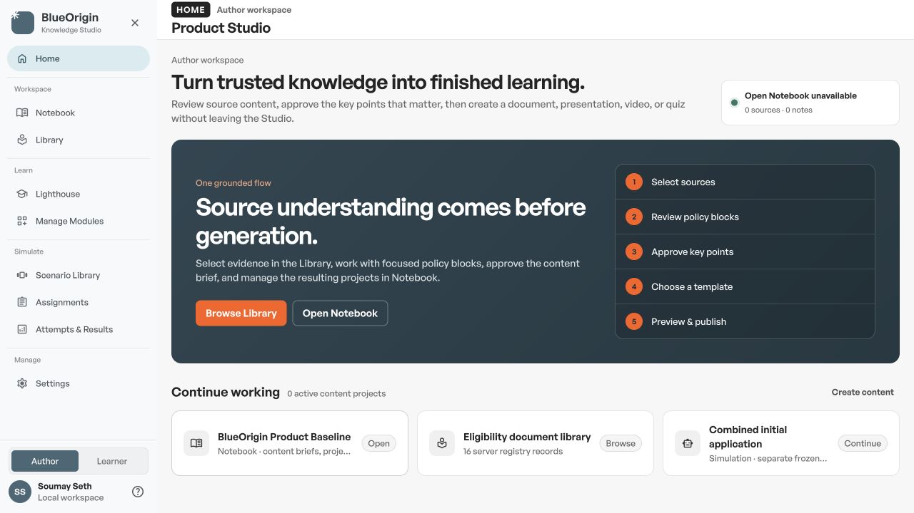

### 2. Notebook list

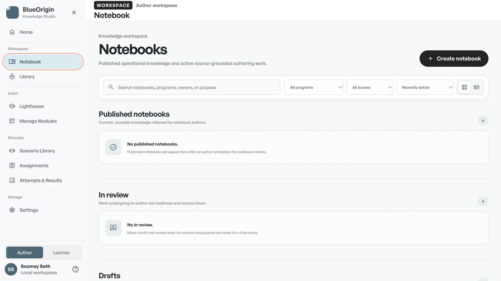

### 3. Source-grounded notebook workspace

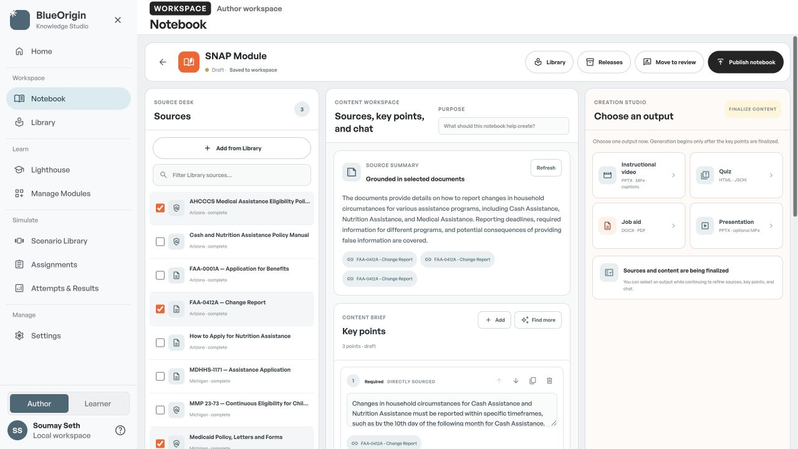

### 4. Library

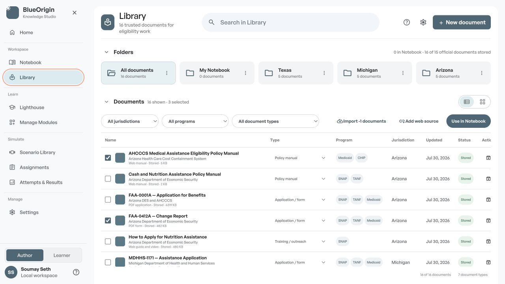

### 5. Scenario Library

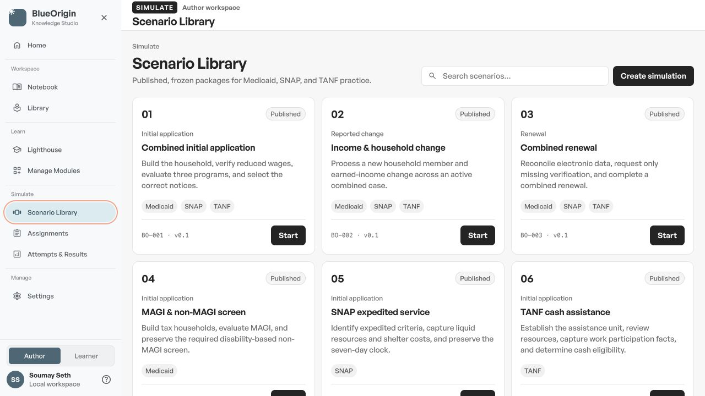

### 6. Simulation setup before the shell correction

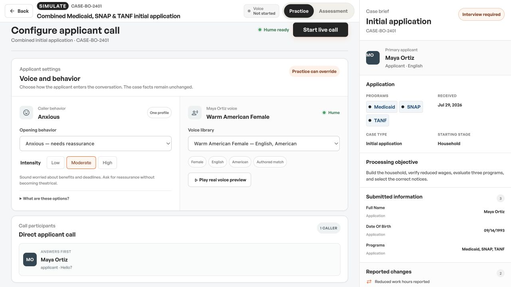

### 7. Simulation method choice

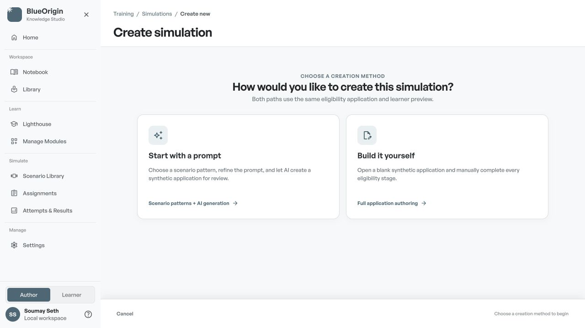

### 8. Prompt path

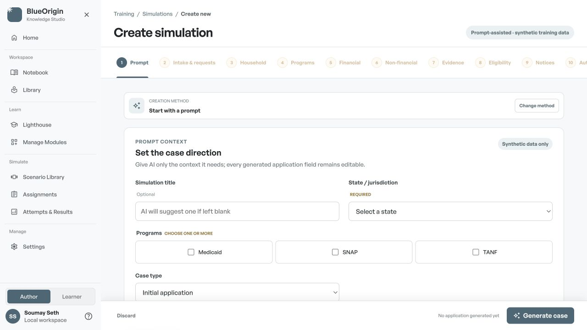

### 9. Manual Intake

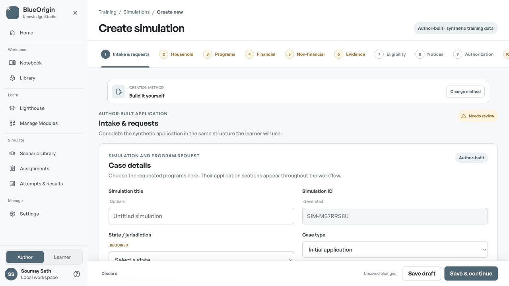

### 10. Lighthouse

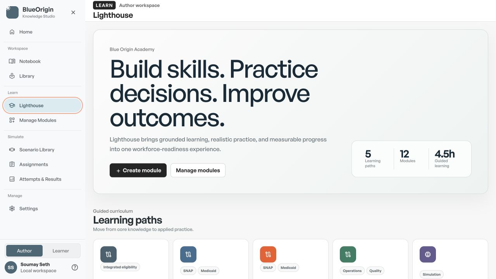

### 11. Assignments

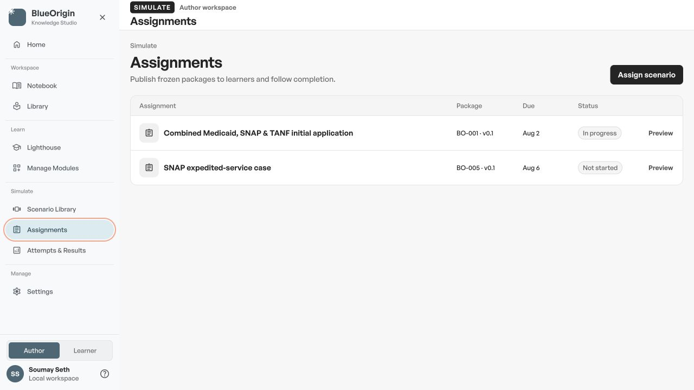

### 12. Attempts & Results

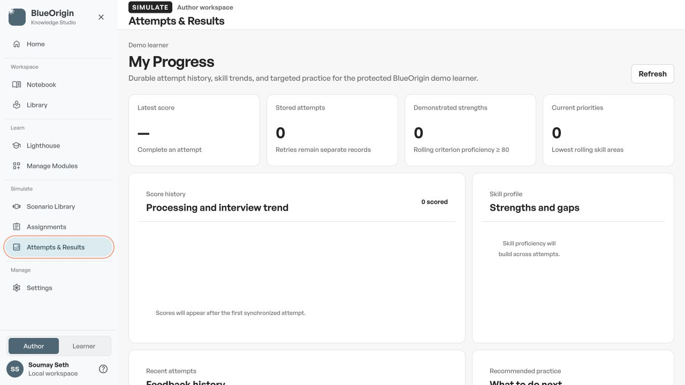

### 13. Settings

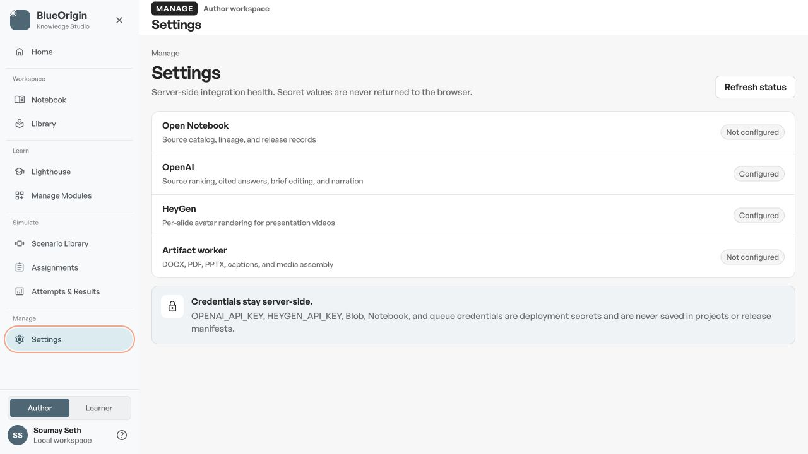

### 14. Learner Home before the role correction

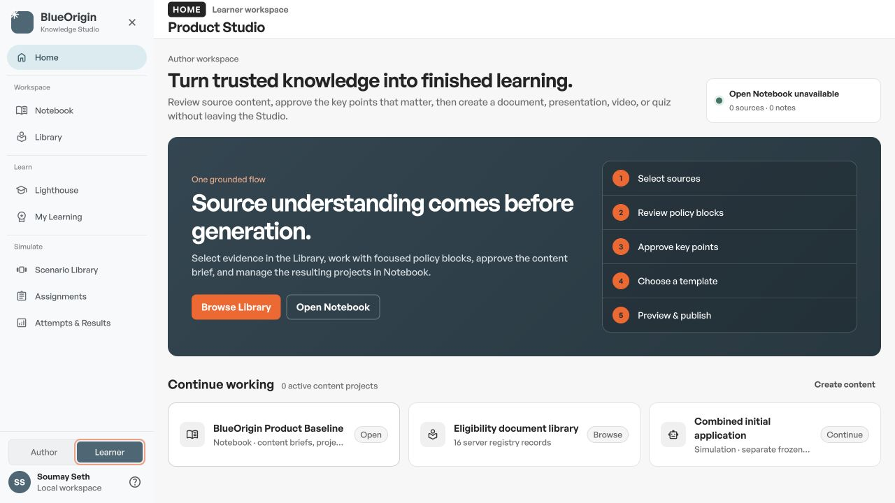

### 15. Simulation setup with persistent Product Studio navigation

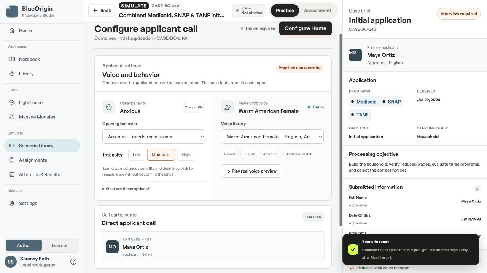

### 16. Narrow simulation layout

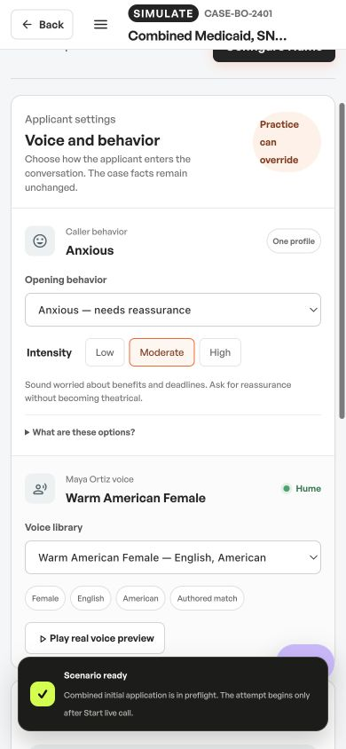

### 17. Narrow simulation navigation drawer

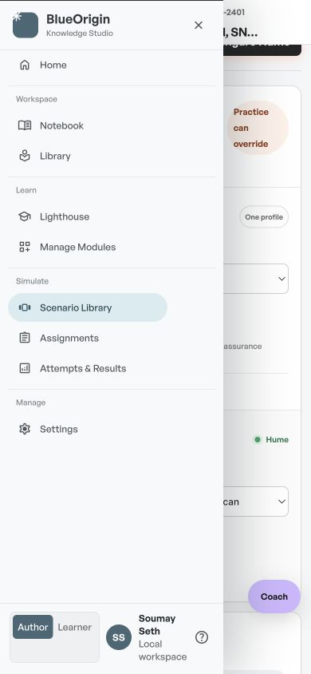

### 18. Learner Home after the role correction

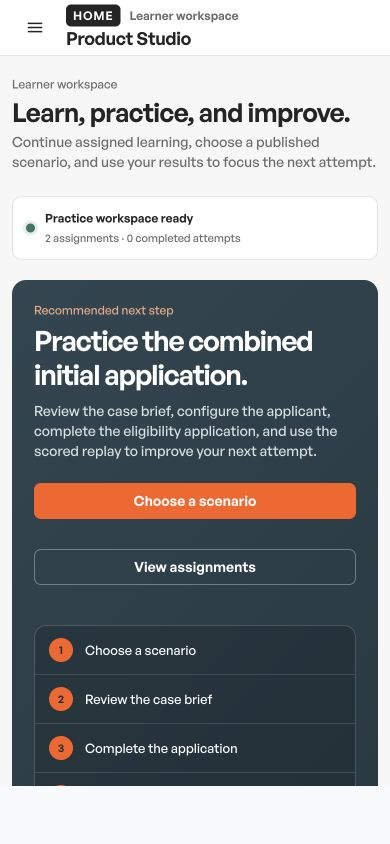

## UX and accessibility findings

### Strengths

- The sidebar gives every major area a stable place and clear active state.
- Scenario creation now uses a clear two-path choice with no premature form burden.
- The shared application stepper communicates complete, active, and Needs review states.
- Notebook source work keeps source selection, content decisions, chat, and output intent visible together.
- Most interactive controls expose useful names and semantic roles in the browser accessibility tree.

### Risks addressed in this pass

- The simulation runtime no longer removes the Product Studio shell.
- Back and feedback no longer send ordinary Scenario Library practice to Assignments.
- Learner role no longer presents author-only source-generation content or author-only navigation.
- Library import copy can no longer show negative document counts.
- Opening a notebook workspace now resets the workspace to the top rather than preserving the list scroll position.
- Product pages on narrow screens no longer show the simulation-only Coach affordance.

### Remaining verification gaps

- A real prompt-generation run was not submitted to OpenAI during this audit.
- A live voice call was not started because microphone permission and Hume transmission require an explicit action-time confirmation.
- Screenshot and DOM inspection support likely accessibility findings, not a full WCAG compliance claim. Screen-reader announcements, full keyboard traversal, 200% zoom, and live-region timing still need hands-on assistive-technology testing.
- Settings accurately exposes that Open Notebook and the artifact worker are not configured in this environment; production output generation that depends on those services remains an operational dependency.

